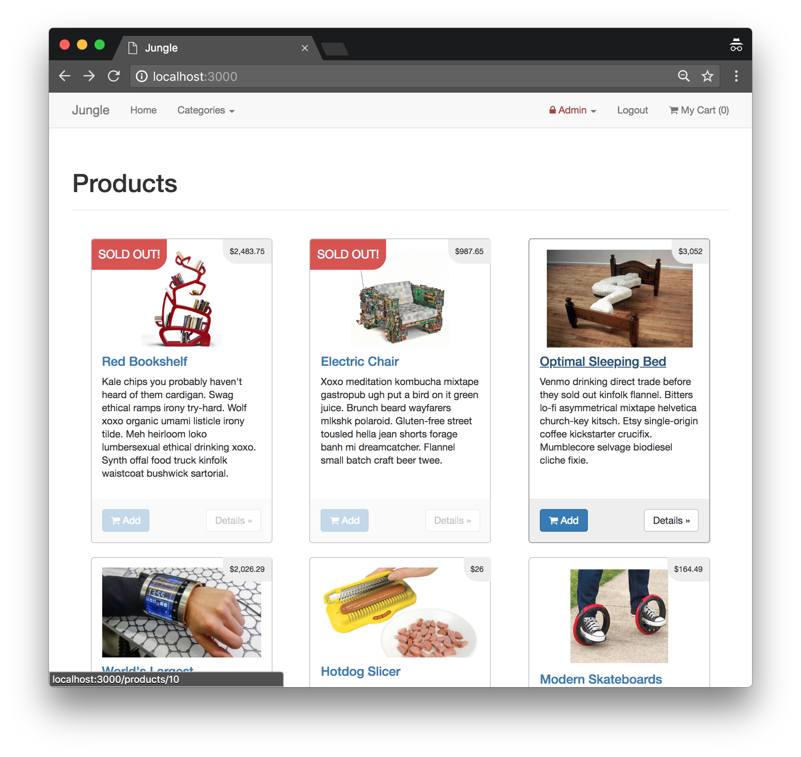
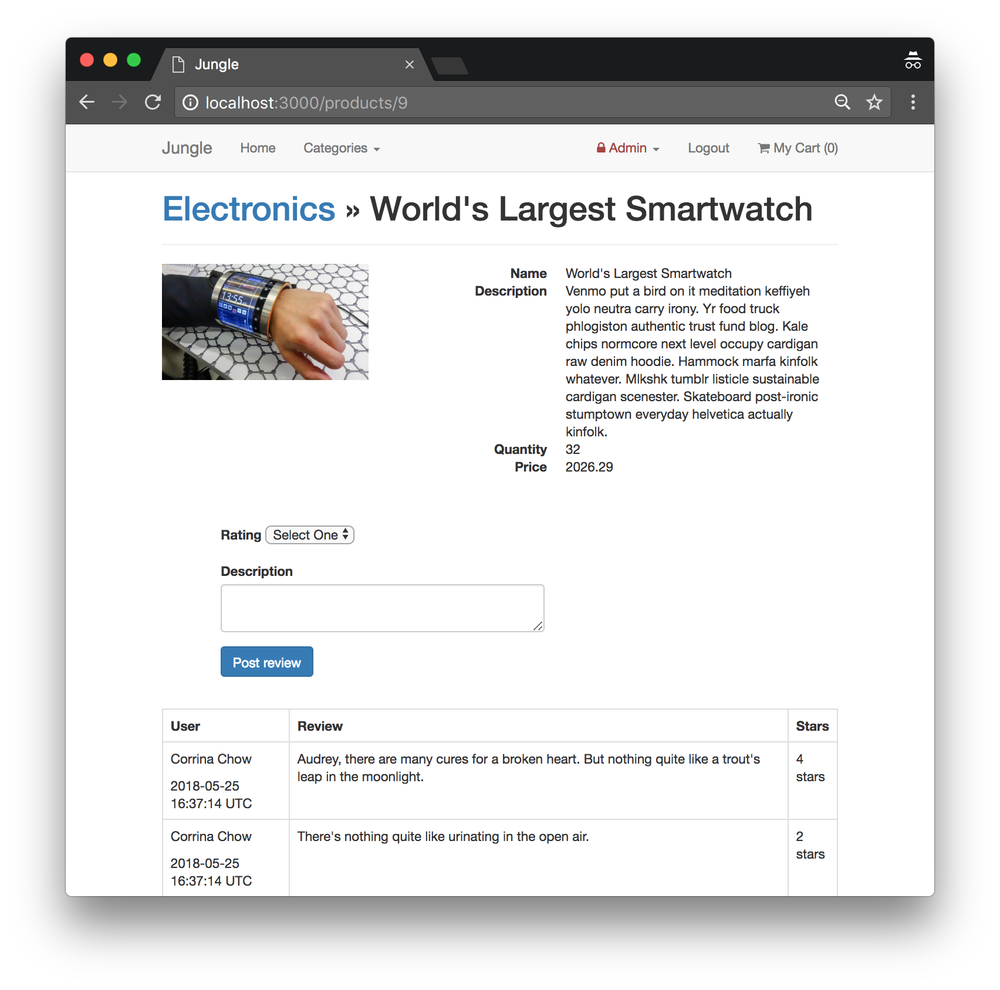
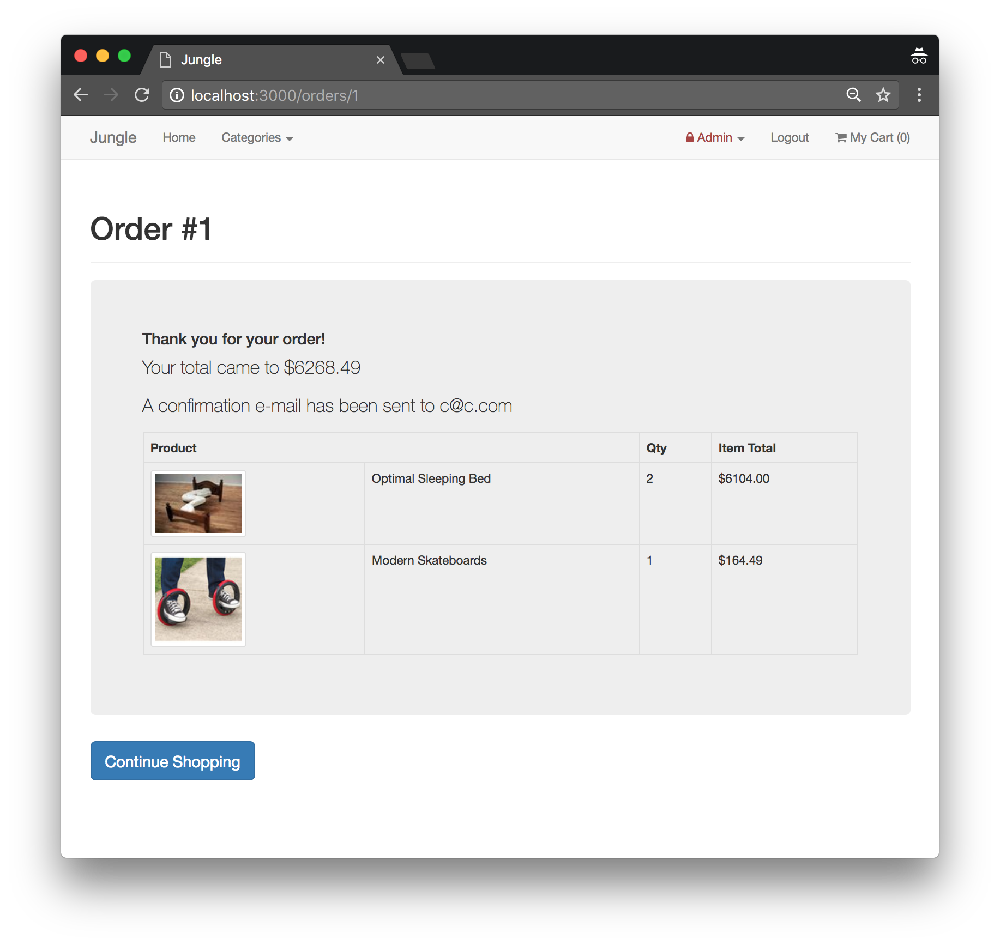

# Jungle

A mini e-commerce application built with Rails 4.2.

Features include:

* Sold Out Badges when a product has 0 quantity
* Admin Control Panel using namespaces
* User Authentication/Registration
* Order Details Page
* Email Receipt formatted in HTML
* Product Ratings

## Final Product

Homepage

Product view

Order confirmation

## Setup

1. Clone this repository
2. Run `bundle install` to install dependencies
3. Create `config/database.yml` by copying `config/database.example.yml`
4. Create `config/secrets.yml` by copying `config/secrets.example.yml`
5. Run `bin/rake db:reset` to create, load and seed db
6. Create .env file based on .env.example
7. Sign up for a Stripe account
8. Put Stripe (test) keys into appropriate .env vars
9. Run `bin/rails s -b 0.0.0.0` to start the server

## Stripe Testing

Use Credit Card # 4111 1111 1111 1111 for testing success scenarios.

More information in their docs: <https://stripe.com/docs/testing#cards>

## Dependancies

- PostgreSQL 9.x
- bcrypt
- bootstrap-sass
- byebug
- carrierwave
- dotenv-rails
- faker
- font-awesome-rails
- jbuilder
- jquery-rails
- money-rails
- newrelic_rpm
- pg
- puma
- quiet_assets
- rails (= 4.2.6)
- rails_12factor
- rmagick
- sass-rails
- sdoc
- spring
- stripe
- turbolinks
- uglifier (>= 1.3.0)
- web-console